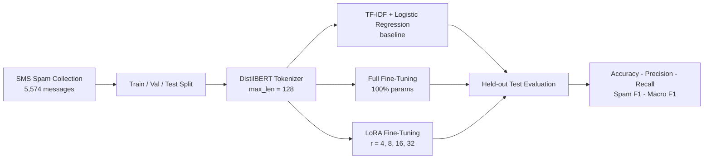
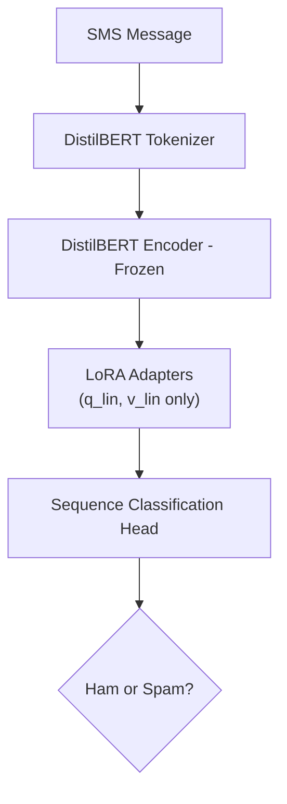

# SMS Spam Classification with DistilBERT and LoRA Fine-Tuning

A parameter-efficient fine-tuning (PEFT) benchmark comparing **TF-IDF + Logistic Regression**, **LoRA (Low-Rank Adaptation)**, and **full fine-tuning** of **DistilBERT** for SMS spam detection — measuring how much of a transformer actually needs to be trained to reach near-full-fine-tuning accuracy.

> **Best PEFT result: 99.42% test accuracy and 97.64% Spam F1 with LoRA rank 32, training only 1.73% of DistilBERT's parameters.**

**Keywords:** LoRA fine-tuning, PEFT, DistilBERT, parameter-efficient fine-tuning, SMS spam detection, text classification, Hugging Face Transformers, NLP, BERT, transfer learning

## Table of Contents

- [Key Results](#key-results)
- [Dataset](#dataset)
- [Pipeline](#pipeline)
- [LoRA Rank Ablation](#lora-rank-ablation)
- [LoRA vs. Full Fine-Tuning](#lora-vs-full-fine-tuning)
- [Compute and Training Efficiency](#compute-and-training-efficiency)
- [Tech Stack](#tech-stack)
- [Inference](#inference)
- [Limitations](#limitations)
- [License](#license)


## Key Results

| Model                         |   Accuracy |   Precision |     Recall |    Spam F1 |   Macro F1 |
| ------------------------------ | ---------: | ----------: | ---------: | ---------: | ---------: |
| Majority Class Baseline        |     86.56% |           — |          — |      0.000 |          — |
| TF-IDF + Logistic Regression   |     96.52% |     100.00% |     72.31% |     83.93% |          — |
| LoRA (r=4)                     |     98.65% |      98.33% |     90.77% |     94.40% |     96.81% |
| LoRA (r=8)                     |     99.03% |      98.39% |     93.85% |     96.06% |     97.76% |
| LoRA (r=16)                    |     99.23% |     100.00% |     93.85% |     96.83% |     98.19% |
| **LoRA (r=32)**                | **99.42%** | **100.00%** | **95.38%** | **97.64%** | **98.65%** |
| **Full Fine-Tuning**           | **99.61%** | **100.00%** | **96.92%** | **98.44%** | **99.11%** |

LoRA (r=32) reaches within **0.19 accuracy points** of full fine-tuning while updating only **1.73%** of DistilBERT's 68M parameters (1,181,954 trainable).

## Dataset

**SMS Spam Collection Dataset** — 5,574 labeled SMS messages tagged `ham` (legitimate) or `spam`. Short, informal, abbreviation-heavy text makes this a good stress test for transformer-based text classification on noisy real-world input.

| Split      | Size  | Purpose                          |
| ---------- | ----: | -------------------------------- |
| Train      | 4,135 | Model training                   |
| Validation |   517 | Checkpoint selection (Macro F1)  |
| Test       |   517 | Final, held-out evaluation only  |

## Pipeline



**Model architecture (LoRA path):**



**Evaluation discipline:** the test set is never touched during training or checkpoint selection — only the validation set (via Macro F1) informs which checkpoint is kept. This avoids optimistic bias from indirectly tuning on test data.

## LoRA Rank Ablation

| LoRA Rank | Trainable Parameters | Trainable % |   Accuracy |    Spam F1 |   Macro F1 |
| --------: | --------------------: | -----------: | ---------: | ---------: | ---------: |
|       r=4 |                665,858 |        0.98% |     98.65% |     94.40% |     96.81% |
|       r=8 |                739,586 |        1.09% |     99.03% |     96.06% |     97.76% |
|      r=16 |                887,042 |        1.31% |     99.23% |     96.83% |     98.19% |
|  **r=32** |          **1,181,954** |    **1.73%** | **99.42%** | **97.64%** | **98.65%** |

Accuracy increases with rank but with diminishing returns — each rank doubling yields a smaller gain, suggesting r=32 approaches the task's effective capacity requirement.

**Config:** `target_modules=["q_lin", "v_lin"]`, `lora_alpha=64`, `lora_dropout=0.1`, `bias="none"`

## LoRA vs. Full Fine-Tuning

| Metric      | Full Fine-Tuning | LoRA (r=32) | Gap        |
| ----------- | ----------------: | -----------: | ---------: |
| Accuracy    |            99.61% |       99.42% | 0.19 pts   |
| Spam F1     |            98.44% |       97.64% | 0.80 pts   |
| Macro F1    |            99.11% |       98.65% | 0.46 pts   |
| Trainable % |              100% |        1.73% | 98.27 pts  |

LoRA closes to within 0.19 accuracy points of full fine-tuning while training a fraction of the parameters — the central tradeoff PEFT methods are built around.

## Compute and Training Efficiency

- **Full fine-tuning required memory-saving techniques** — gradient checkpointing, an 8-bit optimizer (`paged_adamw_8bit`), and gradient accumulation at batch size 1 — to train within available GPU memory.
- **LoRA needed none of these**, training with a standard optimizer at batch size 16.
- **Training time stayed nearly flat across LoRA ranks** (~9.5–10 minutes for r=4 through r=32) — quadrupling adapter capacity added negligible time cost.
- **At deployment**, LoRA's 1.73% parameter footprint means one frozen base model can serve many task-specific adapters (each a few MB) instead of a full model copy per task.

## Tech Stack

**ML/NLP:** Python · PyTorch · Hugging Face Transformers & Datasets · PEFT · LoRA · DistilBERT · Scikit-learn · TF-IDF

**Evaluation:** Accuracy · Precision · Recall · F1 · Macro F1 · Classification Report

## Inference

```python
from transformers import AutoTokenizer, AutoModelForSequenceClassification
from peft import PeftModel
import torch

base_model = "distilbert-base-uncased"
adapter_path = "./models/distilbert-sms-spam-lora-r32"

tokenizer = AutoTokenizer.from_pretrained(base_model)
model = AutoModelForSequenceClassification.from_pretrained(base_model, num_labels=2)
model = PeftModel.from_pretrained(model, adapter_path)
model.eval()

text = "Congratulations! You have won a free prize. Claim now!"
inputs = tokenizer(text, return_tensors="pt", truncation=True, max_length=128)

with torch.no_grad():
    outputs = model(**inputs)

prediction = torch.argmax(outputs.logits, dim=-1).item()
print(model.config.id2label[prediction])  # -> "spam"
```

## Limitations

Trained specifically for **SMS spam classification** — not assumed to generalize to email spam, phishing sites, social media spam, long-form business text, or other languages/scripts. Spam patterns evolve over time, so periodic re-evaluation would be needed before production use.


## License

Educational and research use. Review dataset and pretrained model licenses before commercial use.

**Keywords:** `NLP` `SMS Spam Detection` `Text Classification` `DistilBERT` `BERT` `Transformers` `Hugging Face` `PyTorch` `LoRA` `PEFT` `Parameter-Efficient Fine-Tuning` `Machine Learning` `Deep Learning` `Transfer Learning`

**Suggested GitHub Topics:** `nlp` `machine-learning` `deep-learning` `transformers` `bert` `distilbert` `lora` `peft` `fine-tuning` `huggingface` `pytorch` `text-classification` `spam-detection`